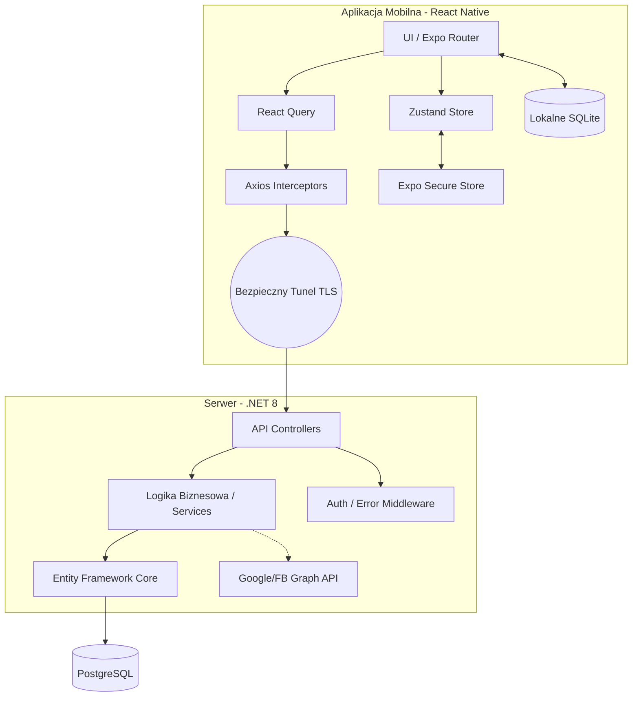
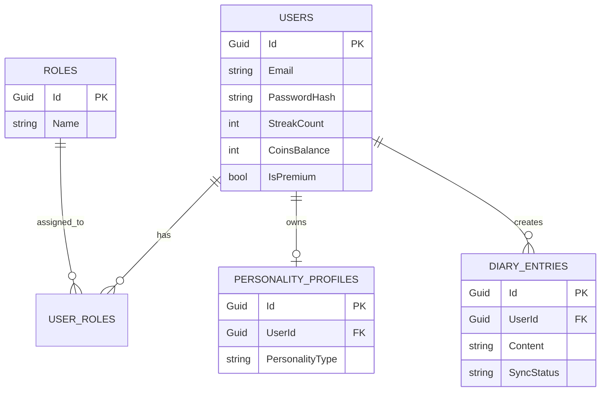
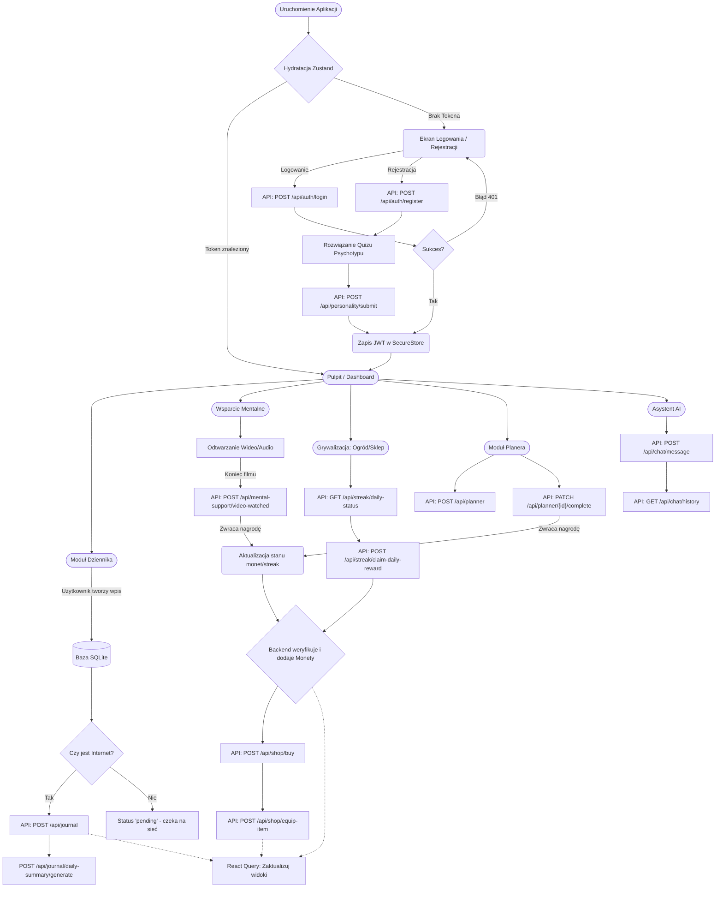

---
# MentalOS - Dokumentacja Techniczna i Architektoniczna

## 1. Wstęp i Cel Projektu

MentalOS to rozbudowana platforma do monitorowania zdrowia psychicznego. Aplikacja łączy w sobie funkcje autoterapii (dziennik, wsparcie mentalne), pomocy specjalistycznej (rezerwacja wizyt) oraz grywalizacji (ogród, sklep), która ma na celu budowanie zdrowych nawyków użytkownika poprzez system nagród (monety) i ciągłości (streaks). System został zaprojektowany z naciskiem na prywatność danych i bezpieczeństwo użytkownika.
---

## 2. Technologie i Uzasadnienie Wyboru

### Frontend (Aplikacja Mobilna)

- **React Native & Expo:** Wybrane ze względu na możliwość kompilacji cross-platform (iOS/Android) z jednej bazy kodu. Expo dostarcza gotowe, natywne moduły (SecureStore, SQLite) bez konieczności konfiguracji Xcode/Android Studio.
- **Expo Router:** Routing oparty na systemie plików (File-based routing). Upraszcza zarządzanie nawigacją (Tab Bar, Stack) i ułatwia wprowadzanie tzw. Auth Guards.
- **TypeScript:** Gwarantuje bezpieczeństwo typów (Type Safety). Interfejsy DTO na frontendzie odzwierciedlają modele z .NET, co eliminuje błędy związane z literówkami w payloadach JSON.
- **Zustand:** Wybrany do zarządzania Stanem Klienta (Client State). Przechowuje sesję użytkownika i motyw aplikacji.
- **React Query:** Odpowiada za Stan Serwera. Automatyzuje cache'owanie, deduplikację zapytań HTTP, stany ładowania (isPending) oraz ponawianie zapytań w przypadku braku sieci (Auto-retry).
- **SQLite:** Użyty do lokalnej bazy danych dla modułu Dziennika. Gwarantuje działanie aplikacji bez dostępu do internetu.

### Backend (REST API)

- **.NET 8 (ASP.NET Core Web API):** Wybrany ze względu na najwyższą wydajność, silne typowanie i wbudowane mechanizmy Dependency Injection oraz autoryzacji (Middleware).
- **Język:** C# 12.0
- **PostgreSQL:** Główna relacyjna baza danych. Gwarantuje spójność ACID, wydajność przy relacjach (Użytkownik -> Role -> Wpisy) oraz wsparcie dla pól JSONB.
- **Entity Framework Core (EF Core):** ORM użyty do abstrakcji bazy danych i zarządzania migracjami.
- **Serilog:** Strukturalne logowanie zdarzeń aplikacji, pozwalające na łatwe filtrowanie logów audytowych (np. błędy logowania).
- **JWT (JSON Web Tokens):** Bezstanowy mechanizm autoryzacji, gwarantujący skalowalność i bezpieczeństwo.

---

## 3. Architektura Systemu

System opiera się na architekturze klient-serwer. Frontend korzysta z architektury modularnej, a backend z architektury warstwowej.



---

## 4. Schemat Bazy Danych



---

## 5. Przepływ Danych w Aplikacji (Activity Flow)

Poniższy diagram obrazuje główną ścieżkę użytkownika, działanie modułów offline oraz mechanizmy integrujące aplikację z systemem grywalizacji.



---

## 6. Szczegółowa Logika Modułów

### A. Autoryzacja i Personalizacja (Psychotyp)

Aplikacja działa w trybie "pamiętaj mnie" z dodatkowym profilowaniem.

1. Podczas rejestracji użytkownik wypełnia **Quiz Osobowości**. Wynik przesyłany jest do endpointu `/api/personality/submit`, co pozwala aplikacji na lepsze spersonalizowanie doświadczenia.
2. Przy ponownym włączeniu aplikacji, `app/_layout.tsx` wywołuje funkcję `hydrate()` ze Store'a.
3. Store asynchronicznie czyta zaszyfrowany token z `expo-secure-store`.
4. Social Login: Aplikacja przekazuje tokeny od Google/FB do endpointów backendu. Backend sam weryfikuje ich poprawność w zewnętrznych API i zwraca własny token JWT MentalOS.

### B. Moduł Dziennika (Offline-First i Upsert)

1. **Lokalny zapis:** Kiedy użytkownik zapisuje wpis, trafia on w pierwszej kolejności do lokalnej bazy SQLite (`diaryDb.ts`) z flagą `syncStatus: "pending"`.
2. **Przekazywanie Kontekstu:** Przejście między ekranami edycji a podsumowania odbywa się z użyciem parametrów URL (przekazywanie `id`).
3. **Upsert:** Jeśli `id` istnieje, wykonywany jest UPDATE. Jeśli nie, generowane jest nowe UUID i wykonywany jest INSERT.
4. **Synchronizacja w tle:** Zapytania asynchroniczne szukają wpisów o statusie "pending" i wysyłają je do bazy w .NET, zmieniając lokalny status na "synced".

### C. Grywalizacja (Streaks, Ogród i Sklep)

Logika portfela użytkownika znajduje się po stronie serwera dla zapewnienia bezpieczeństwa transakcji.

1. **Nagrody za aktywność:** Odznaczanie zadań w Planerze (`toggleComplete`) oraz kończenie sesji Wsparcia Mentalnego (`trackVideoWatched`) zwraca obiekt `WelcomeReward`.
2. **Aktualizacja:** Przychód monet automatycznie unieważnia (invalidate) cache w React Query dla stanu konta, co natychmiast odświeża licznik monet w sklepie (ShopScreen) i ogródku (GardenScreen).
3. **Sklep:** Frontend wyłącznie wysyła intencję zakupu (`/api/shop/buy`). Ostateczna weryfikacja salda i przyznanie przedmiotu odbywa się w .NET.

### D. Asystent AI i Wsparcie Mentalne

- **Asystent:** Oparty na promptach czat z wykorzystaniem API zewnętrznego (OpenAI) pośredniczonego przez backend (/api/chat/message).
- **Wsparcie Mentalne:** Baza materiałów relaksacyjnych (oddechowych, medytacyjnych). Moduł śledzi postęp użytkownika i po ukończeniu ćwiczenia zasila moduł Grywalizacji.

### E. Moduł Planera (Zarządzanie Zadaniami)

Planer służy do harmonogramowania dnia i działa w trybie Online (Synchronous REST API), co gwarantuje spójność zadań na różnych urządzeniach użytkownika.

1. **Przetwarzanie DTO (Data Transfer Object):** Serwis frontendowy (planner.service.ts) posiada warstwę abstrakcji (metoda mapToPlannerTask), która tłumaczy surowy format z bazy danych na struktury używane w komponentach React.
2. **Optymalizacja zapytań (PATCH):** Podczas odznaczania zadań jako wykonane, aplikacja nie wysyła pełnego obiektu. Używa lekkiego zapytania PATCH /api/planner/{id}/complete, co minimalizuje użycie przepustowości sieci.
3. **Integracja z Grywalizacją:** Moduł ten jest aktywnie spięty z systemem motywacyjnym. Endpoint kończący zadanie może zwrócić w odpowiedzi obiekt WelcomeReward. Oznacza to, że za zrealizowanie celu z planera, użytkownik jest natychmiastowo nagradzany w obrębie aplikacji.

---

## 7. Struktura Projektu i Kluczowe Klasy

Struktura bazuje na ścisłym podziale modułowym (Feature-Sliced Design), co zapobiega powstawaniu kodu typu "spaghetti" przy rosnącej liczbie funkcjonalności.

### Frontend (frontend/)

code Text

```
src/
├── modules/                 # Niezależne moduły biznesowe
│   ├── assistant/           # (Czat AI, prompty, widoki wiadomości)
│   ├── diary/               # (DB lokalne, edytor, widoki wpisów)
│   ├── garden/              # (Grywalizacja, punkty za logowanie)
│   ├── home/                # (Pulpit główny / Dashboard)
│   ├── mentalSupport/       # (Ćwiczenia oddechowe, odtwarzacz wideo)
│   ├── planner/             # (Zadania, harmonogram, kalendarz)
│   ├── profile/             # (Ustawienia konta, statystyki)
│   ├── psychologists/       # (Lista dostępnych specjalistów)
│   ├── psychotype/          # (Analiza i wyniki quizu osobowości)
│   ├── shop/                # (Sklep z akcesoriami za monety z grywalizacji)
│   └── visits/              # (Rezerwacja i historia wizyt)
├── services/
│   ├── api/client.ts        # Strażnik komunikacji HTTP (Interceptors)
│   ├── store/useAuthStore.ts# Pamięć RAM sesji użytkownika (Zustand)
│   └── storage.ts           # Interfejs expo-secure-store
├── hooks/                   # React Query mutacje (np. useAuthMutations)
├── types/                   # Interfejsy TypeScript (DTO, auth.types.ts)
└── shared/                  # Komponenty uniwersalne (Button, LayoutContainer)
```

### Backend (backend/MentalOS/)

code Text

```
MentalOS/
├── Controllers/
│   └── AuthController.cs    # Endpointy logowania, rejestracji i Social Auth
├── Services/
│   ├── OAuthService.cs      # Komunikacja z API Google/Facebook
│   └── TokenService.cs      # Generowanie i podpisywanie JWT
├── Data/
│   └── AppDbContext.cs      # Konfiguracja Entity Framework Core
└── Middleware/
    └── ErrorHandlingMiddleware.cs # Przechwytywanie wyjątków i formatowanie na JSON
```

---

## 8. Bezpieczeństwo i Obsługa Błędów

### Bezpieczeństwo (Security First)

1. **Brak haseł w logach i lokalnych DB:** Hasła są natychmiast przesyłane do backendu. Backend soli je i haszuje (PBKDF2 HMAC-SHA256).
2. **Bezpieczny schowek:** Expo-secure-store wykorzystuje enklawy sprzętowe systemu iOS (Keychain) oraz Android (Keystore).
3. **Zasada Minimalnych Uprawnień:** API udostępnia dedykowane endpointy dla administratorów chronione atrybutem [Authorize(Roles = "admin")].

### Obsługa Błędów

1. **Frontend:** React Query przejmuje wszystkie błędy Axios. Wyświetlanie błędu następuje deklaratywnie poprzez sprawdzanie flagi isError i odczyt z error.response?.data?.message.
2. **Backend:** Oparty na wzorcu Global Error Handler Middleware. Zamiast rzucać ekranami błędu HTML (YSOD), każdy wyjątek (np. błąd bazy) jest logowany przez Serilog i zwracany do telefonu jako czytelny obiekt JSON o strukturze: { "statusCode": 500, "message": "..." }.

---

## 9. Instrukcja Uruchomienia

### Wymagania Wstępne

- **Backend:** .NET 8.0 SDK, Docker Desktop (dla PostgreSQL).
- **Frontend:** Node.js (LTS), aplikacja Expo Go na telefonie lub Android Studio (Emulator).

### Uruchomienie Backendu

1. Przejdź do folderu backendu.
2. Upewnij się, że posiadasz poprawny plik appsettings.Development.json.
3. Uruchom kontener z bazą danych: docker-compose up -d
4. Wykonaj migracje bazy: dotnet ef database update
5. Uruchom serwer: dotnet run (Serwer wystartuje nasłuchując na porcie 5076 na wszystkich interfejsach - 0.0.0.0).

### Uruchomienie Frontendu

1. Przejdź do folderu frontendu.
2. Zainstaluj zależności: npm install
3. Utwórz plik środowiskowy .env
4. Edytuj .env podając poprawny adres backendu:
   - Dla Emulatora Androida: EXPO_PUBLIC_API_URL=http://10.0.2.2:5076/api
   - Dla fizycznego telefonu: EXPO_PUBLIC_API_URL=http://<TWOJE-IP-LOKALNE>:5076/api

5. Uruchom Metro Bundler czyszcząc cache: npx expo start -c
